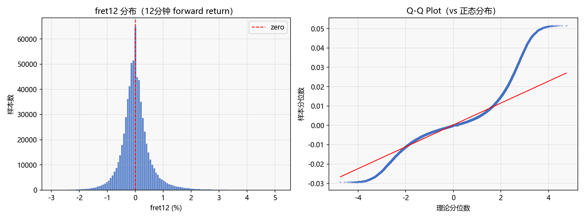
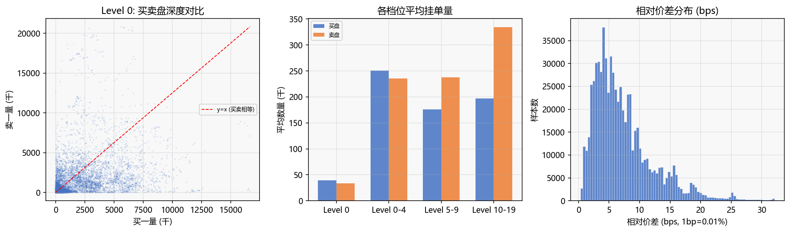
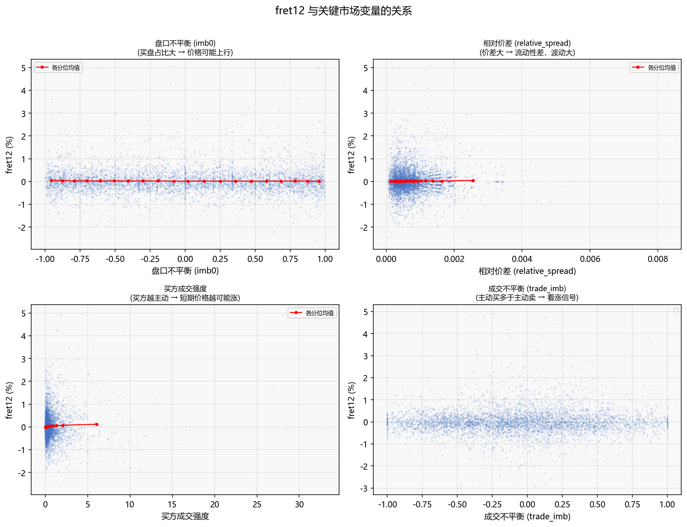
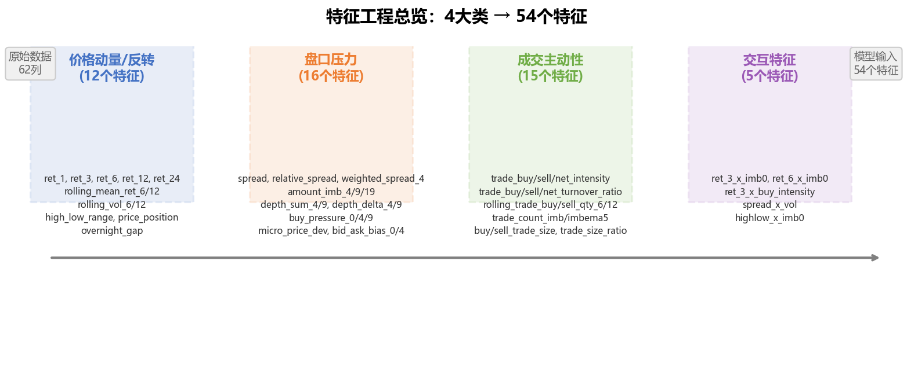

# MEOW 金融时序预测 — 项目报告

## 1. 项目背景与任务定义

本项目的目标是预测股票 12 分钟后的价格变化率（fret12）。数据覆盖约 300 只 A 股从 2023 年 6 月到 12 月的分钟级行情，包括价格、订单簿（order book）、成交明细和委托/撤单事件。

任务本质上是一个**短周期收益率预测**问题。和图像识别或者推荐系统不一样，金融时序预测有几个特殊的地方：数据噪声极大、收益率分布是肥尾而不是正态的、而且市场状态本身也在不断变化（non-stationary）。所以一般来说，预测的时间越短准确率越高——12 分钟是一个比较折中的选择，既给了模型反应空间，也不至于把太多噪声卷进来。

项目流程分为四个环节：**数据分析 → 特征工程 → 模型训练 → 结果评估**。本文档覆盖前两个环节（A 的分工），模型和 Agent 部分由 B 和 C 分别完成。

---

## 2. 数据说明与探索性分析（EDA）

数据来源：Kaggle 上的 MEOW 数据集，格式为按天存储的 HDF5 文件，每天约 7 万行。原始数据有 62 个字段，可以分为以下几类：

| 类别 | 代表性字段 | 说明 |
|------|-----------|------|
| 标的 & 时间 | symbol, interval, date | 股票代码、毫秒级时间戳、日期 |
| 目标值 | **fret12** | 12 分钟后的 forward return，我们要预测的东西 |
| 价格 | midpx, lastpx, open, high, low, bid0, ask0, bid4, ask4 | 中间价、成交价、OHLC、买卖挂单价 |
| 盘口量 | bsize0, asize0, bsize0_4, asize0_4, ... | 各档位买卖挂单数量 |
| 盘口额 | btr0_4, atr0_4, ... | 各档位买卖挂单金额（价格 × 数量） |
| 成交 | nTradeBuy, tradeBuyQty, tradeBuyTurnover, ... | 主买/主卖成交的笔数、数量、金额 |
| 委托/撤单 | nAddBuy, addBuyQty, nCxlBuy, cxlBuyQty, ... | 新增和撤销的买卖委托 |

### 2.1 数据规模

使用的样本为 2023 年 6 月到 12 月共 144 个交易日。309 只股票，每天每只大约 226 条分钟级记录。训练集用 6 月到 11 月（123 天），测试集用 12 月（21 天），**两段时间完全不重叠**，这样评估结果才能反映真实的泛化能力。

### 2.2 fret12 的分布特征

fret12 是最值得关注的变量。它的分布有以下几个关键特点：

- **均值接近零**（~0.0001）：12 分钟尺度上，市场整体没有明显方向性，符合有效市场假说
- **标准差约 0.64%**：大部分时候 12 分钟价格变化在 ±1% 以内
- **偏度 2.17，峰度 22.6**：分布不是正态的——有明显的右偏和厚尾。少数极端 12 分钟能涨 10% 或跌 10%，这种极端值既是噪声也是信号
- **约 6% 的样本 fret12 = 0**：说明部分股票在 12 分钟内中间价没有变化，通常是流动性较差的标的

从 Q-Q 图可以很清楚地看到，fret12 的尾部严重偏离正态分布。这意味着用 MSE 作为损失函数虽然顺手，但模型可能会被极端值牵着走——这也是为什么业界更看重 Pearson Correlation 这个指标，它不受数值尺度影响。

### 2.3 价格与价差

数据的 309 只股票价格跨度很大，从两三块钱到三百多块都有。买卖一档价差（ask0 - bid0）均值大约 0.02 元，相对价差均值约 0.075%（7.5 bps）。价差在日内呈现明显的 U 型——开盘和收盘附近价差更大，盘中流动性更好。

### 2.4 盘口结构

一个很有意思的发现是：**卖盘几乎在所有档位上都多于买盘**。Level 0-4 的卖盘数量平均比买盘多约 8.7%，金额也多约 8.6%。这可能是因为：

- A 股市场本身卖盘挂单就偏多（融券成本高，做空不方便，持有者更倾向于挂卖单）
- 或者是数据覆盖的这段时间（2023 年下半年）市场整体偏谨慎

从深度分布看，越深层的档位（5-9 档、10-19 档）挂单量越大，说明流动性主要集中在价格稍远的位置。这在实际交易中意味着：**如果想快速成交大单，需要吃掉好几档，冲击成本不低**。

### 2.5 成交特征

每个分钟间隔内平均有约 136 笔成交，其中主买占 65 笔、主卖占 71 笔。成交数量上也是卖方向略多（imbalance 约 -7.3%）。买方的平均单笔成交量略大于卖方，说明买盘以大单为主的特征更明显。

成交强度（成交量 / 盘口深度）均值约 0.67，意思是每分钟大概有 67% 的挂单量被成交掉——这个比例说明市场流动性还不错，但也意味着盘口变化很快。

### 2.6 缺失值情况

缺失值主要集中在成交价的高/低字段（tradeBuyHigh/Low 等），以及 VWAP 相关字段。原因很简单：如果某个 interval 里没有主买成交，那主买的最高/最低价就没有定义。这部分缺失约在 1%-3%，在特征工程里统一填 0 处理。

更深档位的 bid/ask 也有零星缺失（<0.05%），通常是流动性较差股票的某些时刻没有挂到那么远的价格。

### 2.7 关键变量与 fret12 的关系

在构造特征之前，先扫一遍原始变量和 fret12 的线性相关性：

| 变量 | 线性相关系数 | 解读 |
|------|-----------|------|
| 买方成交强度 | +0.040 | 相关性最强，买方越主动、短期越可能涨 |
| 盘口不平衡（Level 0） | -0.012 | 卖盘更多 → 价格稍偏下行 |
| 相对价差 | +0.010 | 价差大时波动大，但方向不确定 |
| 盘口不平衡（Level 0-4） | -0.006 | 和多档汇总的趋势一致 |

线性相关性整体都不高（绝对值最大才 0.04），这说明两点：第一，单一原始变量的预测能力确实有限；第二，需要用非线性模型来捕捉变量之间的交互关系。这也是为什么我们要做特征工程——通过组合和变换，把原始数据里的信号提炼出来。

---

## 3. 特征工程设计

特征工程的思路来自市场微观结构理论。短期价格变动主要由订单流（order flow）驱动——谁在买、谁在卖、挂了多少、撤了多少、成交了多少。我们围绕这个逻辑设计了四类特征。

**总览：**

### 3.1 价格动量/反转特征（12 个）

**设计思路**：短期价格变化存在两种对立的效应——动量（涨了继续涨）和反转（涨了会回调）。到底是动量还是反转，取决于时间尺度、成交结构和市场状态。所以我们构造多个时间窗口的历史收益，让模型自己去学哪个窗口在什么条件下有效。

| 特征名 | 计算方式 | 金融含义 |
|--------|---------|---------|
| ret_1, ret_3, ret_6, ret_12, ret_24 | (midpx(t) - midpx(t-k)) / midpx(t-k) | 不同时间尺度的历史收益率，捕获动量和反转信号 |
| rolling_mean_ret_6, rolling_mean_ret_12 | ret_1 在 6/12 窗口内的均值 | 近期趋势方向——往上还是往下 |
| rolling_vol_6, rolling_vol_12 | ret_1 在 6/12 窗口内的标准差 | 近期波动水平——波动大的时候往往有交易机会 |
| high_low_range | (high - low) / midpx | 区间内多空争夺的剧烈程度 |
| price_position | (lastpx - low) / (high - low) | 收盘价在区间内的位置，接近高点说明买方占优 |
| overnight_gap | (open - prev_close) / prev_close | 隔夜信息对开盘的冲击，仅首分钟有效 |

**为什么可能影响 12 分钟收益**：动量/反转是量化交易里最经典的两类因子。短周期（1-3 分钟）的反转效应往往来自于流动性提供者的买卖价差收益；中周期（6-12 分钟）的动量效应可能来自信息传播的不充分。模型可以通过组合不同窗口的收益来捕捉这些效应。

### 3.2 盘口压力特征（16 个）

**设计思路**：订单簿是市场状态的快照。买卖挂单的数量和金额直接反映了当前时刻供需双方的力量对比。如果买盘比卖盘厚，说明这个价位买方意愿更强，价格更容易往上走。

| 特征名 | 计算方式 | 金融含义 |
|--------|---------|---------|
| spread | ask0 - bid0 | 绝对价差，单位是元 |
| relative_spread | (ask0 - bid0) / midpx | 相对价差，跨股票可比 |
| weighted_spread_4 | (vwap_ask_4 - vwap_bid_4) / midpx | 加权价差，考虑各档深度的 spread |
| amount_imb_4/9/19 | (atr - btr) / (atr + btr) | 各档位金额不平衡——钱在哪边 |
| depth_sum_4, depth_sum_9 | bsize + asize | 总深度，深度越大流动性越好 |
| depth_delta_4, depth_delta_9 | depth_sum(t) - depth_sum(t-1) | 深度变化速度——有人在吃单还是挂单 |
| buy_pressure_0/4/9 | bsize / (bsize + asize) | 买方挂单比例，>0.5 说明买方更多 |
| micro_price_dev | (micro_price - midpx) / midpx | 微观价格偏离：订单权重价 vs 简单中间价 |
| bid_ask_bias_0/4 | (bid × bsize - ask × asize) / sum | 价格和数量双加权的买卖偏向 |

**为什么可能影响 12 分钟收益**：盘口不平衡是高频交易中最核心的信号之一。如果买盘金额显著大于卖盘，说明这个价位有较强的买盘支撑，即使有卖单进来也不容易把价格打下去。反之，卖盘堆积意味着上涨阻力大。micro_price_dev 这个特征还额外捕捉了买卖盘在价格上的不对称——有时候即使数量差不多，价格分布也能透露出方向。

### 3.3 成交主动性特征（15 个）

**设计思路**：挂单只是意愿，成交才是行动。主买（买方主动吃掉卖方的挂单）代表买方进攻意愿强，主卖则相反。成交的主动性、强度和节奏能反映出市场参与者的真实意图。

| 特征名 | 计算方式 | 金融含义 |
|--------|---------|---------|
| trade_buy/sell/net_intensity | tradeQty / depth_sum_4 | 成交量占盘口深度的比例——多大比例的被吃掉了 |
| trade_buy/sell/net_turnover_ratio | tradeTurnover / (btr + atr) | 成交额占挂单额的比例 |
| rolling_trade_buy/sell_qty_6/12 | tradeQty 在窗口内滚动求和 | 近期成交活跃度 |
| trade_count_imb | (nTradeBuy - nTradeSell) / sum | 成交笔数的不平衡 |
| trade_count_imbema5 | trade_count_imb 的 EMA(halflife=5) | 平滑后的成交笔数不平衡趋势 |
| buy/sell_trade_size | tradeQty / nTrade | 单笔平均成交量——大单还是小单 |
| trade_size_ratio | buy_trade_size / sell_trade_size | 买卖单笔大小比——哪边更大手笔 |

**为什么可能影响 12 分钟收益**：成交主动性是市场微观结构里最直接的"方向信号"。当买方不断主动吃掉卖盘挂单（高 trade_buy_intensity），说明有资金在坚定地买入，这种买压通常会在几分钟内推动价格上涨。成交笔数不平衡和单笔大小比则能从"频率"和"力度"两个角度补充信息——比如大单主买和小单主买的市场含义是不同的。

### 3.4 交互特征（5 个）

**设计思路**：单一维度的信号有时候不够强，但两个信号交叉可能产生新的信息。比如盘口买压大 + 近期动量向上 = 买盘支撑下的上涨趋势可能延续；价差大 + 波动率高 = 流动性紧张叠加不确定性，可能是反转信号。

| 特征名 | 计算方式 | 金融含义 |
|--------|---------|---------|
| ret_3_x_imb0 | ret_3 × ob_imb0 | 短期动量 × 盘口不平衡 —— 方向一致性 |
| ret_6_x_imb0 | ret_6 × ob_imb0 | 中期动量 × 盘口不平衡 |
| ret_3_x_buy_intensity | ret_3 × trade_buy_intensity | 动量 × 买方力度 |
| spread_x_vol | relative_spread × rolling_vol_12 | 流动性紧张 × 高波动 |
| highlow_x_imb0 | high_low_range × ob_imb0 | 剧烈争夺 × 盘口偏向 |

**为什么可能影响 12 分钟收益**：交互特征的思路是"方向一致时信号更可靠"。比如盘口显示买盘压力大（imb > 0），同时过去 3 分钟的收益率也是正的，那这两个信号互相印证，比单独看任何一个都更有说服力。反过来，如果盘口买压大但价格在跌（动量向下），可能说明卖方的力量比盘口显示的更强——这也是信息。

---

## 4. 后续计划（待 B / C 完成）

- **B 负责**：用这批特征训练模型，对比 Ridge baseline 和 GBT 的效果，给出 MSE / Pearson / R² 指标
- **C 负责**：用大模型辅助挖掘候选因子，做轻量交易 Agent 和简单回测
- **A 待做**：根据 B 的实验结果对特征做增删，把最终的特征集和解释写进报告终版

---

## 附录：代码文件说明

| 文件 | 负责 | 说明 |
|------|------|------|
| `meow.py` | 入口 | 主流程引擎，调用各模块 |
| `dl.py` | 原始 | 数据加载器，按日期读取 HDF5 |
| `feat.py` | **A** | 特征生成器，54 个特征 / 4 大类 |
| `eda.py` | **A** | EDA 分析脚本 |
| `gen_figures.py` | **A** | 报告图表生成脚本 |
| `mdl.py` | A / B | 模型定义（Ridge + GBT） |
| `eval.py` | 原始 | 评估器（MSE / Pearson / R²） |
| `tradingcalendar.py` | 原始 | 交易日历工具 |
| `log.py` | 原始 | 日志工具 |
